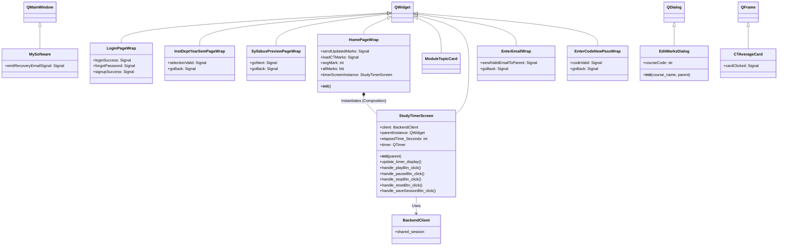

```mermaid
classDiagram
    %% Base Qt Classes
    class QMainWindow
    class QWidget
    class QDialog
    class QFrame

    %% Inheritance Relationships
    QMainWindow <|-- MySoftware
    QWidget <|-- LoginPageWrap
    QWidget <|-- InstDeptYearSemPageWrap
    QWidget <|-- SyllabusPreviewPageWrap
    QWidget <|-- HomePageWrap
    QWidget <|-- ModuleTopicCard
    QWidget <|-- StudyTimerScreen
    QWidget <|-- EnterEmailWrap
    QWidget <|-- EnterCodeNewPassWrap
    QDialog <|-- EditMarksDialog
    QFrame <|-- CTAverageCard

    %% Backend Client
    class BackendClient {
        +shared_session
    }

    %% Main Application Window
    class MySoftware {
        +emitRecoveryEmailSignal: Signal
    }

    %% Authentication & Onboarding Wrappers
    class LoginPageWrap {
        +loginSuccess: Signal
        +forgotPassword: Signal
        +signupSuccess: Signal
    }

    class EnterEmailWrap {
        +sendValidEmailToParent: Signal
        +goBack: Signal
    }

    class EnterCodeNewPassWrap {
        +codeValid: Signal
        +goBack: Signal
    }

    class InstDeptYearSemPageWrap {
        +selectionValid: Signal
        +goBack: Signal
    }

    class SyllabusPreviewPageWrap {
        +goNext: Signal
        +goBack: Signal
    }

    %% Home Page & Dashboard Components
    class HomePageWrap {
        +sendUpdatedMarks: Signal
        +loadCTMarks: Signal
        +avgMark: int
        +allMarks: list
        +timerScreenInstance: StudyTimerScreen
        +__init__()
    }

    class CTAverageCard {
        +cardClicked: Signal
    }

    class EditMarksDialog {
        +courseCode: str
        +__init__(course_name, parent)
    }

    %% Syllabus Tab Components
    class ModuleTopicCard {
    }

    %% Study Timer Tab Components
    class StudyTimerScreen {
        +client: BackendClient
        +parentInstance: QWidget
        +elapsedTime_Seconds: int
        +timer: QTimer
        +__init__(parent)
        +update_timer_display()
        +handle_playBtn_click()
        +handle_pauseBtn_click()
        +handle_stopBtn_click()
        +handle_resetBtn_click()
        +handle_saveSessionBtn_click()
    }

    %% Object Relationships
    HomePageWrap *-- StudyTimerScreen : Instantiates (Composition)
    StudyTimerScreen --> BackendClient : Uses
```