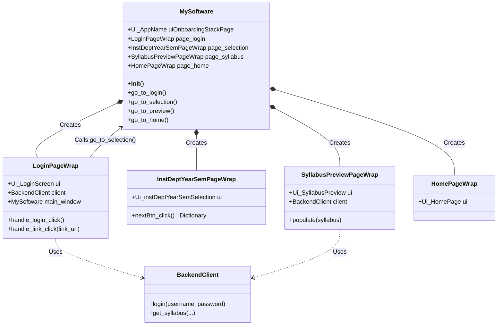

```mermaid
classDiagram
    %% The Main Application Controller
    class MySoftware {
        +Ui_AppName uiOnboardingStackPage
        +LoginPageWrap page_login
        +InstDeptYearSemPageWrap page_selection
        +SyllabusPreviewPageWrap page_syllabus
        +HomePageWrap page_home
        +__init__()
        +go_to_login()
        +go_to_selection()
        +go_to_preview()
        +go_to_home()
    }

    %% Page 1: Login
    class LoginPageWrap {
        +Ui_LoginScreen ui
        +BackendClient client
        +MySoftware main_window
        +handle_login_click()
        +handle_link_click(link_url)
    }

    %% Page 2: Selection
    class InstDeptYearSemPageWrap {
        +Ui_instDeptYearSemSelection ui
        +nextBtn_click() Dictionary
    }

    %% Page 3: Syllabus Preview
    class SyllabusPreviewPageWrap {
        +Ui_SyllabusPreview ui
        +BackendClient client
        +populate(syllabus)
    }

    %% Page 4: Home Dashboard
    class HomePageWrap {
        +Ui_HomePage ui
    }

    %% The API Handler
    class BackendClient {
        +login(username, password)
        +get_syllabus(...)
    }

    %% Relationships
    %% MySoftware "owns" (composes) these pages
    MySoftware *-- LoginPageWrap : Creates
    MySoftware *-- InstDeptYearSemPageWrap : Creates
    MySoftware *-- SyllabusPreviewPageWrap : Creates
    MySoftware *-- HomePageWrap : Creates

    %% Pages "use" the BackendClient
    LoginPageWrap ..> BackendClient : Uses
    SyllabusPreviewPageWrap ..> BackendClient : Uses

    %% Login Page "calls back" to MySoftware to change pages
    LoginPageWrap --> MySoftware : Calls go_to_selection()
```