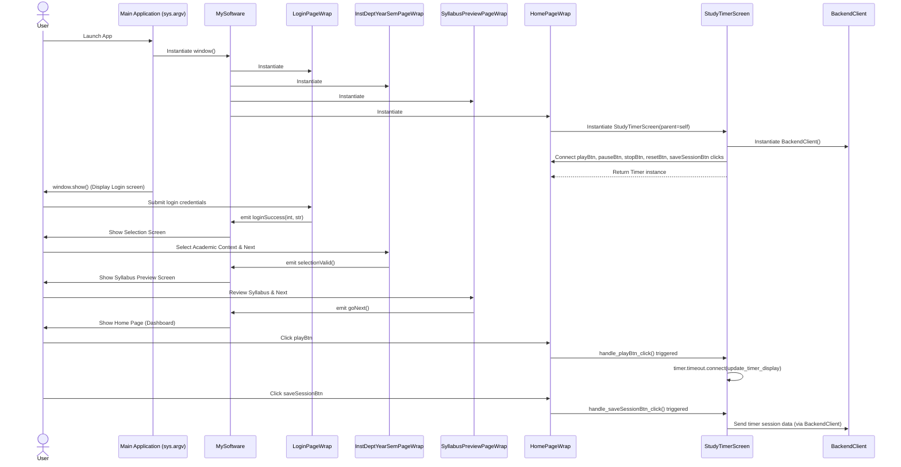

```mermaid
sequenceDiagram
    actor User
    participant App as Main Application (sys.argv)
    participant Main as MySoftware
    participant Login as LoginPageWrap
    participant Selection as InstDeptYearSemPageWrap
    participant Preview as SyllabusPreviewPageWrap
    participant Home as HomePageWrap
    participant Timer as StudyTimerScreen
    participant Client as BackendClient

    %% 1. Application Initialization
    User->>App: Launch App
    App->>Main: Instantiate window()
    
    %% Wrapper setup (assumed based on standard structure and signals)
    Main->>Login: Instantiate
    Main->>Selection: Instantiate
    Main->>Preview: Instantiate
    Main->>Home: Instantiate
    
    %% Home Page internal setup
    Home->>Timer: Instantiate StudyTimerScreen(parent=self)
    Timer->>Client: Instantiate BackendClient()
    Timer->>Home: Connect playBtn, pauseBtn, stopBtn, resetBtn, saveSessionBtn clicks
    Timer-->>Home: Return Timer instance
    
    App->>User: window.show() (Display Login screen)

    %% 2. User Onboarding Flow
    User->>Login: Submit login credentials
    Login->>Main: emit loginSuccess(int, str)
    Main->>User: Show Selection Screen
    
    User->>Selection: Select Academic Context & Next
    Selection->>Main: emit selectionValid()
    Main->>User: Show Syllabus Preview Screen
    
    User->>Preview: Review Syllabus & Next
    Preview->>Main: emit goNext()
    Main->>User: Show Home Page (Dashboard)

    %% 3. Study Timer Interaction
    User->>Home: Click playBtn
    Home->>Timer: handle_playBtn_click() triggered
    Timer->>Timer: timer.timeout.connect(update_timer_display)
    
    User->>Home: Click saveSessionBtn
    Home->>Timer: handle_saveSessionBtn_click() triggered
    Timer->>Client: Send timer session data (via BackendClient)
```