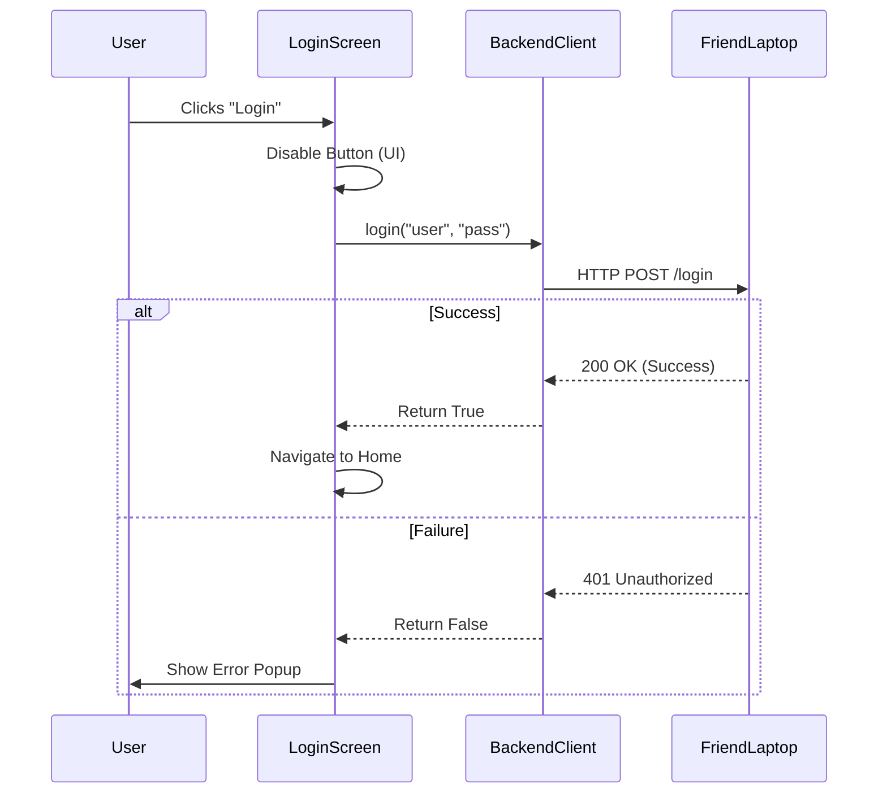

```mermaid
sequenceDiagram
    participant User
    participant LoginScreen
    participant BackendClient
    participant FriendLaptop

    User->>LoginScreen: Clicks "Login"
    LoginScreen->>LoginScreen: Disable Button (UI)
    LoginScreen->>BackendClient: login("user", "pass")
    
    BackendClient->>FriendLaptop: HTTP POST /login
    
    alt Success
        FriendLaptop-->>BackendClient: 200 OK (Success)
        BackendClient-->>LoginScreen: Return True
        LoginScreen->>LoginScreen: Navigate to Home
    else Failure
        FriendLaptop-->>BackendClient: 401 Unauthorized
        BackendClient-->>LoginScreen: Return False
        LoginScreen->>User: Show Error Popup
    end
```